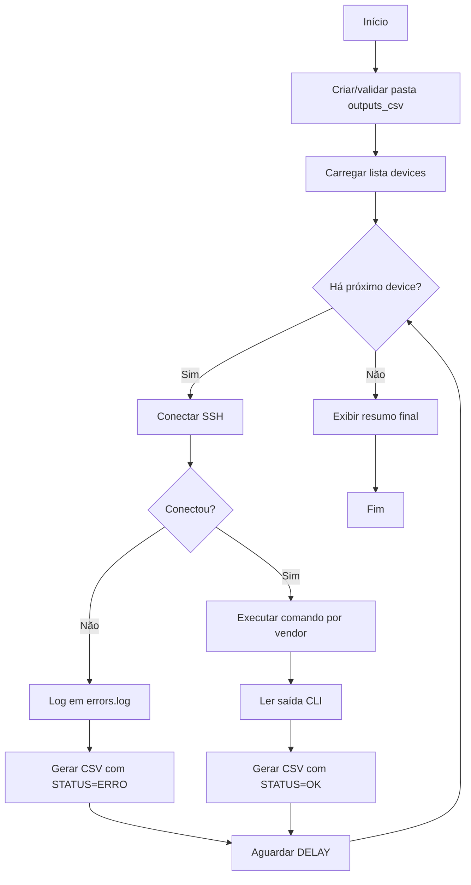
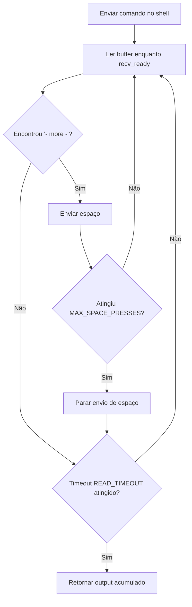
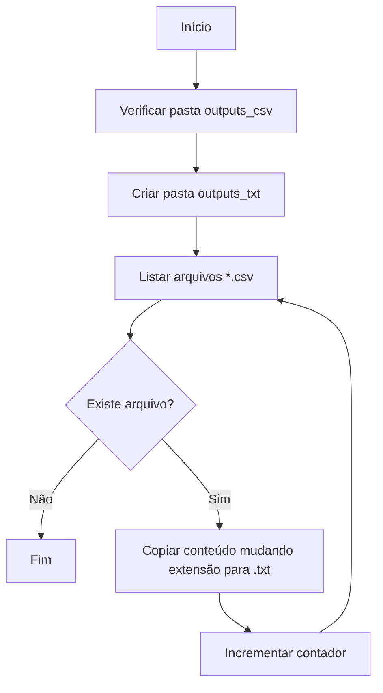

# ScriptConsulta

Automação de coleta de configuração via SSH em equipamentos de rede (Huawei e Juniper), com saída em CSV por dispositivo e log de erros.

## Visão geral

Este projeto executa comandos CLI por fabricante, captura o retorno completo e salva um arquivo CSV por equipamento processado.

Fluxo principal:
1. Lê uma lista fixa de dispositivos no código (`script.py`).
2. Conecta via SSH com `paramiko`.
3. Executa comandos por vendor.
4. Salva a coleta em `outputs_csv/`.
5. Registra falhas em `errors.log`.

## Fluxogramas (Mermaid)

### 1) Coleta principal



### 2) Paginação e leitura de saída



### 3) Conversão CSV -> TXT



## Requisitos

- Python 3.9+
- Acesso de rede SSH aos equipamentos
- Dependência Python:
  - `paramiko`

## Instalação

```bash
python -m venv .venv
# Windows (PowerShell)
.\.venv\Scripts\Activate.ps1
pip install paramiko
```

## Como usar

Executar a coleta:

```bash
python script.py
```

Saídas esperadas:
- Arquivos CSV por device em `outputs_csv/`
- Log de erros em `errors.log`

## Rotas (paths) do projeto

- Script principal: `script.py`
- Entrada de dispositivos: lista `devices` dentro de `script.py`
- Saída de coletas (CSV): `outputs_csv/`
- Saída convertida para TXT: `outputs_txt/`
- Log de erros: `errors.log`

## Comandos por vendor

- Huawei:
  - `dis current-configuration all`
- Juniper:
  - `show configuration | display set | no-more`

## Estrutura dos arquivos CSV

Cada CSV possui:
- Linha de metadado com timestamp (`COLLECTED_AT`)
- Cabeçalho principal: `DEVICE, IP, VENDOR, STATUS, CONFIG, COLLECTED_AT`
- Uma linha com o resultado da coleta

Status possíveis:
- `OK`: coleta concluída
- `ERRO`: falha de conexão/execução/vendor não suportado

## Logs e tratamento de erro

- Falhas são gravadas em `errors.log` com timestamp, device e IP.
- Mesmo em erro, o script gera um CSV com `STATUS=ERRO` e a mensagem da falha.

## Segurança (dados sensíveis)

Este repositório lida com informações sensíveis de rede. Antes de publicar no GitHub:

1. Não versione credenciais reais.
2. Não publique IPs reais dos equipamentos.
3. Não publique dumps completos de configuração sem anonimização.
4. Remova/mascare arquivos em `outputs_csv/`, `outputs_txt/` e `errors.log`.

Recomendado (hardening):
- Mover `USERNAME` e `PASSWORD` para variáveis de ambiente.
- Mover lista `devices` para arquivo externo (`.csv`/`.json`) fora do versionamento público.
- Criar `.gitignore` para impedir commit de saídas e logs.

Exemplo de `.gitignore` recomendado:

```gitignore
outputs_csv/
outputs_txt/
errors.log
.venv/
__pycache__/
*.pyc
.env
```

## Melhorias sugeridas

- Adicionar retry com backoff para falhas transitórias de SSH.
- Externalizar parâmetros (`DELAY`, `READ_TIMEOUT`, comandos por vendor).
- Suportar execução paralela controlada por lote.
- Exportar também para `.txt` automaticamente ao final da coleta.

## Aviso

Use este script somente em ambientes autorizados e sob políticas de segurança da sua organização.
